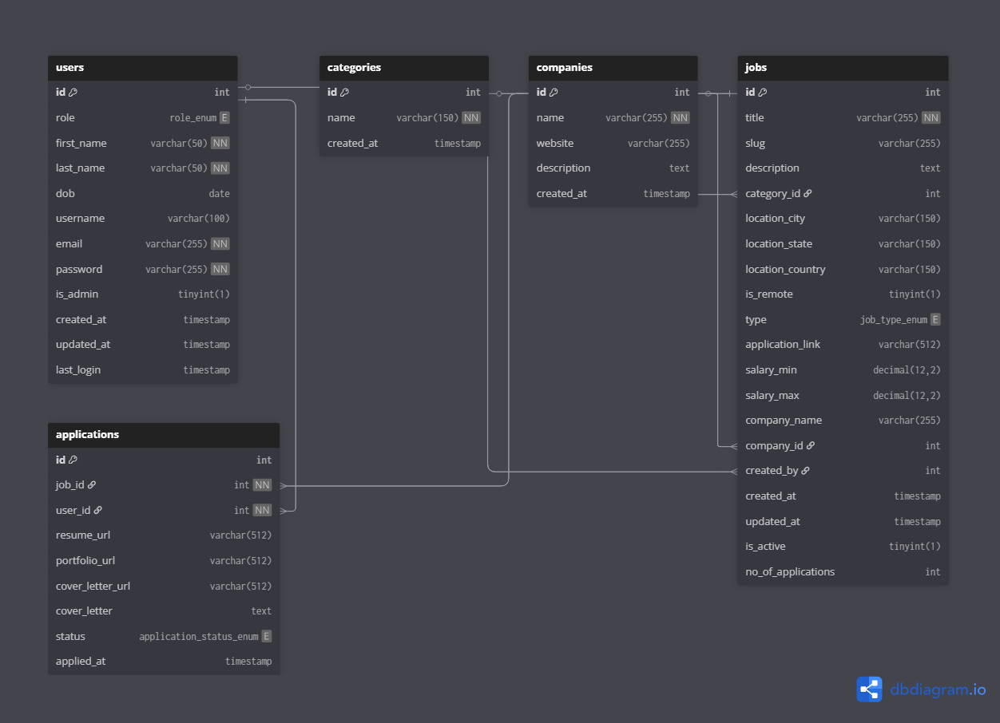

# RemoSphere — A Remote Job Board (Backend)


*Remosphere* is a production-ready **Job Board backend** focused on remote and flexible work, built as my ALX ProDev Backend Nexus Project.
It’s designed to demonstrate professional backend engineering: secure auth & role-based access, efficient database design and full-text search, well-documented REST APIs, tests, containerized deployment, and clear developer docs (public Swagger).

This README is a single, crystal-clear source of truth for developers, mentors, and reviewers — it contains the project purpose, architecture, tech stack, data model, API contracts summary, auth flows, setup & deployment steps, testing & CI guidance, acceptance criteria, and deliverables.

---

## Table of contents

1. [Project Summary](#project-summary)
2. [Key Features](#key-features)
3. [Tech Stack](#tech-stack)
4. [Architecture Overview](#architecture-overview)
5. [Data Model (Summary)](#data-model-summary)
6. [API — Quick Reference & Key Flows](#api---quick-reference--key-flows)
7. [Authentication & Verification Flow](#authentication--verification-flow)
8. [Search, Filtering & Pagination](#search-filtering--pagination)
9. [File storage & Attachments](#file-storage--attachments)
10. [Database details & notes](#database-details--notes)
11. [Local development (Docker) & setup](#local-development-docker--setup)
12. [Seeding Admin Account](#seeding-admin-account)
13. [Testing & CI/CD](#testing--cicd)
14. [Deployment (production)](#deployment-production)
15. [Presentation & Demo checklist (Capstone)](#presentation--demo-checklist-capstone)
16. [Acceptance Criteria / Mentor Checklist](#acceptance-criteria--mentor-checklist)
17. [Project Roadmap / Stretch Goals](#project-roadmap--stretch-goals)
18. [Contributing, License & Credits](#contributing-license--credits)

---

## Project summary

**RemoSphere** is a backend API for a remote jobs marketplace targeting ALX Nigeria alumni (and open to any authenticated users). Users sign up after verifying their email; admins are seeded manually. The API supports job posting CRUD (admin), job browsing & full-text search (users), applications (users), and admin oversight of applications. Swagger docs are public for integration testing and ease of review.

---

## Key features

* Secure signup with **email verification** (user created only after verification)
* JWT authentication with short-lived access + refresh pattern
* **Role-based access control** (`admin` / `user`) — admins manage jobs/categories
* CRUD for jobs & categories (admin)
* Job browsing with:

  * category filtering,
  * location filtering (city/state/country),
  * job type filter (full_time, part_time, contract, etc.),
  * `is_remote` flag,
  * pagination (cursor recommended)
  * full-text search (title + description),
* Apply for jobs (one application per user per job)
* DB-level constraints (unique `job_id,user_id`), indexes, and a `job_application_counts` view
* Public API documentation at `/api/docs` (Swagger + Django REST Framework)

---

## Tech stack

* **Backend**: Django + Django REST Framework (DRF)
* **Database**: PostgreSQL (hosted via Supabase)
* **Auth**: JWT (SimpleJWT or equivalent) — prefer HttpOnly cookies for refresh tokens
* **File storage**: Supabase Storage (resumes, cover letters)
* **Email**: SendGrid (verification & notifications)
* **Background jobs** (optional/for stretch): Celery + Redis / RabbitMQ
* **API docs**: drf-spectacular or drf-yasg (Swagger UI) — **public** at `/api/docs` or `/swagger`
* **Deployment**: Render (API & docs), Vercel (future frontend)
* **CI**: GitHub Actions (tests, lint, build)
* **ERD tool**: dbdiagram.io for visual schema

---

## Architecture overview

```
Client (Frontend / Postman / Swagger) 
    ↕ (HTTPS)
Django REST API (gunicorn / uvicorn)
    ↕
PostgreSQL (Supabase)  ←→  Supabase Storage (files)
    ↕
(Celery workers) ←→ Redis / RabbitMQ  (optional)
SendGrid (email)
GitHub Actions -> CI/CD -> Render
```

Key rules:

* Swagger docs are public, but all protected endpoints require a valid JWT.
* Admin accounts are seeded manually (or via management command) — normal users register via email verification flow.

---

## Data model — concise table summaries (Postgres / Supabase)



See [ERD.md](/ERD.md) for more information

<!-- 
> Use UUIDs for portability and security. If you must use integers in a MySQL variant, map UUID→INT accordingly.

### Enums (DB / app-level)

* `role_enum`: `admin`, `user`
* `job_type_enum`: `full_time`, `part_time`, `contract`, `internship`, `temporary`, `freelance`
* `application_status_enum`: `pending`, `reviewed`, `shortlisted`, `rejected`, `offered`, `withdrawn`

---

### `users`

| Column          | Type                | Notes                                            |
| --------------- | ------------------- | ------------------------------------------------ |
| `id`            | `uuid` PK           | `gen_random_uuid()`                              |
| `first_name`    | `text`              | required                                         |
| `last_name`     | `text`              | required                                         |
| `dob`           | `date`              | optional                                         |
| `username`      | `text` UNIQUE       | generated from names, ensure uniqueness          |
| `email`         | `text` UNIQUE       | verified before creation                         |
| `password_hash` | `text`              | store hashed password if not using Supabase Auth |
| `role`          | `role_enum`         | default `user`                                   |
| `is_admin`      | `boolean` GENERATED | derived from role                                |
| `date_joined`   | `timestamptz`       | default `now()`                                  |
| `last_login`    | `timestamptz`       | optional                                         |

---

### `categories`

| Column       | Type          | Notes                     |
| ------------ | ------------- | ------------------------- |
| `id`         | `serial` PK   |                           |
| `name`       | `text` UNIQUE | e.g., Engineering, Design |
| `created_at` | `timestamptz` | default `now()`           |

---

### `companies` (optional)

| Column        | Type          | Notes                                            |
| ------------- | ------------- | ------------------------------------------------ |
| `id`          | `uuid` PK     | optional                                         |
| `name`        | `text` UNIQUE | denormalize into `jobs.company_name` if not used |
| `website`     | `text`        | optional                                         |
| `description` | `text`        | optional                                         |
| `created_at`  | `timestamptz` | default `now()`                                  |

---

### `jobs`

| Column               | Type            | Notes                                           |
| -------------------- | --------------- | ----------------------------------------------- |
| `id`                 | `uuid` PK       | primary key                                     |
| `title`              | `text`          | indexed for search/filters                      |
| `slug`               | `text` UNIQUE   | url-friendly                                    |
| `description`        | `text`          | full description                                |
| `category_id`        | `integer`       | FK → `categories.id` (ON DELETE SET NULL)       |
| `location_city`      | `text`          | optional                                        |
| `location_state`     | `text`          | optional                                        |
| `location_country`   | `text`          | optional                                        |
| `is_remote`          | `boolean`       | default `false`                                 |
| `type`               | `job_type_enum` | default `full_time`                             |
| `application_link`   | `text`          | external link if used                           |
| `salary_min`         | `numeric`       | optional                                        |
| `salary_max`         | `numeric`       | optional                                        |
| `company_name`       | `text`          | denormalized                                    |
| `company_id`         | `uuid`          | optional FK → `companies.id`                    |
| `created_by`         | `uuid`          | FK → `users.id` (ON DELETE SET NULL)            |
| `created_at`         | `timestamptz`   | default `now()`                                 |
| `updated_at`         | `timestamptz`   | on update                                       |
| `is_active`          | `boolean`       | default `true`                                  |
| `no_of_applications` | `integer`       | prefer view/materialized view; optional trigger |
| `search_vector`      | `tsvector`      | generated from title + description; GIN index   |

**Important indexes**

* `GIN (search_vector)` for full-text search
* B-tree indexes on `category_id`, `type`, `is_remote`, `created_at`
* Composite index `(category_id, type, created_at)` if needed for filter heavy queries

---

### `applications`

| Column             | Type                      | Notes                                                  |
| ------------------ | ------------------------- | ------------------------------------------------------ |
| `id`               | `uuid` PK                 |                                                        |
| `job_id`           | `uuid` FK                 | `jobs.id` ON DELETE CASCADE                            |
| `user_id`          | `uuid` FK                 | `users.id` ON DELETE CASCADE                           |
| `resume_url`       | `text`                    | signed URL from Supabase Storage                       |
| `portfolio_url`    | `text`                    | optional                                               |
| `cover_letter_url` | `text`                    | optional                                               |
| `cover_letter`     | `text`                    | optional inline text                                   |
| `status`           | `application_status_enum` | default `pending`                                      |
| `applied_at`       | `timestamptz`             | default `now()`                                        |
| **Constraint**     |                           | `UNIQUE(job_id, user_id)` — prevents duplicate applies |

**Recommended view**

* `job_application_counts` view: `SELECT job_id, COUNT(*) AS application_count FROM applications GROUP BY job_id;`
-->


---

## API — Quick reference & key flows

> Full OpenAPI/Swagger is public at `/api/docs` (or `/swagger`). Use that for exact request/response JSON schemas. Below are the primary endpoints and examples.

### Auth & User

* `POST /api/auth/signup/request-verification` — { email } → send verification email (public)
* `GET /api/auth/verify?token=...` — validate token (public)
* `POST /api/auth/signup/complete` — { token, first_name, last_name, password } → create user after verification (public w/token)
* `POST /api/auth/login` — { email, password } → returns `access_token`, `refresh_token` (public)
* `POST /api/auth/logout` — invalidate refresh token (auth)
* `GET /api/users/me` — profile (auth)
* `PATCH /api/users/me` — update profile (auth)

### Jobs & categories

* `GET /api/jobs/` — list jobs (auth) — filters: `q`, `category_id`, `location_city`, `is_remote`, `type`, `min_salary`, `max_salary`, pagination + ordering
* `GET /api/jobs/{id}/` — job details (auth) — includes `application_count`, `has_applied`
* `POST /api/jobs/{id}/apply/` — apply to job (auth) — payload includes `resume_url` and optional fields
* `GET /api/categories/` — list categories (auth)
* **Admin only**: `POST /api/categories/`, `POST /api/jobs/`, `PATCH /api/jobs/{id}/`, `DELETE /api/jobs/{id}/`, `GET /admin/jobs/{id}/applications/`, `PATCH /api/applications/{id}/status/`

---

## Authentication & verification flow (detailed)

1. **Signup request (email only)**: user posts email → server validates domain (optional ALX rule) → generate short-lived verification token → send email via SendGrid with verification link.
2. **User clicks verification link**: link contains token → server validates token; on success, redirect to frontend registration or provide token for completing signup.
3. **Complete signup**: client posts token + first_name/last_name/password → server validates token, creates `users` record (role=`user`) and returns success or tokens.
4. **Login**: user posts email + password → server validates and returns JWTs; token claims include `role`.
5. **Authorization**: Middleware verifies access token on each request. Admin checks `role == 'admin'`.

**Security Implementations**

* Store refresh tokens server-side or use rotating refresh tokens.
* Issue access tokens short-lived (e.g., 15 minutes).
* Use HTTPS and set cookies `Secure`, `HttpOnly`, `SameSite=Strict` when using cookies.
* Rate-limit signup, login, and apply endpoints.

---

## Search, filtering & pagination

* Use `search_vector` (Postgres `tsvector`) on `jobs.title` + `jobs.description` and a GIN index to support `q` full-text searches.
* Filters: `category_id`, `location_city`, `location_country`, `is_remote`, `type`.
* Pagination: support cursor pagination for scalability. Provide `meta` object with `next_cursor` or page metadata for offset-based queries.
* Use `select_related` / `prefetch_related` in Django to avoid N+1 problems.
* Provide `ordering` param (e.g., `ordering=-created_at`).

---

<!-- 
## Database details & notes

* Prefer `UUID` primary keys for `users`, `jobs`, `applications`, `companies`. (Supabase/Postgres friendly.)
* Keep `no_of_applications` as a derived column via a view or materialized view — avoids consistency bugs. If real-time denormalized counts are required, use triggers to increment/decrement (but be careful with update/rollback logic).
* Ensure DB constraint: `UNIQUE (job_id, user_id)` on `applications`.
* Create indexes for common filters and full-text: GIN for `search_vector`, b-tree for `category_id`, `type`, `is_remote`, `created_at`.

-->

<!-- 

## Local development (Docker) — quick start

**Prereqs**: Docker, docker-compose, Python 3.10+, Supabase project (or local Postgres), SendGrid account.

1. Clone repo:

```bash
git clone git@github.com:<you>/remosphere.git
cd remosphere
```

2. Copy example env:

```bash
cp .env.example .env
# Edit .env with your DB connection, SUPABASE keys, SENDGRID_API_KEY, SECRET_KEY, ALLOWED_HOSTS, etc.
```

3. Start services (dev):

```bash
docker-compose up --build
```

This should start:

* `web` (Django + gunicorn)
* `db` (postgres) *or* connect to your Supabase DB
* `redis` (optional)
* `worker` (if Celery enabled)

4. Run migrations & create local admin (or seed):

```bash
docker-compose exec web python manage.py migrate
docker-compose exec web python manage.py loaddata initial_data.json   # if seed provided
# OR create an admin via management command/SQL
docker-compose exec web python manage.py createsuperuser
```

5. Run tests:

```bash
docker-compose exec web python manage.py test
```

6. Open Swagger UI:

* `http://localhost:8000/api/docs/`  (public)

-->

## Environment variables (example `.env`)

```
DEBUG=True
SECRET_KEY=your-secret-key
DATABASE_URL=an_example
SUPABASE_URL=https://xyz.supabase.co
SUPABASE_KEY=public-anon-or-service-key
SENDGRID_API_KEY=SG.xxxxx
ALLOWED_HOSTS=localhost,127.0.0.1
DJANGO_ALLOWED_HOSTS=localhost
SIMPLE_JWT_SECRET_KEY=your-jwt-secret
```

---

## Seeding Admin account

You will manually seed an admin account (not public). Options:

1. **Management command** (recommended)
   Create a Django management command `seed_admin` that creates a `users` record with `role='admin'`. Use env-stored admin credentials (only for dev).
2. **SQL script** (for Supabase SQL editor)
3. **createsuperuser** then set `role` to `admin` in DB or via admin panel.

**Example SQL (Postgres):**

```sql
INSERT INTO users (id, first_name, last_name, email, password_hash, role, date_joined)
VALUES (gen_random_uuid(), 'Admin', 'User', 'admin@remosphere.app', '<hashed-password>', 'admin', now());
```

(If using Supabase Auth, create auth user then create profile row with `role='admin'`.)

---

<!-- 
## Testing & CI/CD

* **Tests**: unit tests for models/serializers, integration tests for endpoints (signup/verify/login, job search, apply, admin CRUD). Aim for fast test suite (<3min).
* **CI pipeline (GitHub Actions)**: `on: [push, pull_request]` — steps:

  * checkout
  * set up python
  * install deps
  * run `flake8` / `isort`
  * run tests
  * build docker image (optional)
  * (optional) run migrations & deploy to staging on merge to `staging` branch
* Example action: `ci.yml`

-->

<!-- 

## Deployment (Render) — high level

* Build Docker image and push to container registry (Render supports direct GitHub deploy of Dockerfile).
* Set environment variables (DATABASE_URL with Supabase DB, SENDGRID_API_KEY, SECRET_KEY).
* Configure healthchecks and concurrency limits. Use `gunicorn` as WSGI server.
* Ensure static files are collected or use WhiteNoise.
* Set up periodic or on-demand tasks for refreshing materialized views if using them.

-->

<!-- 
## Presentation & Demo checklist (Capstone)

Include these in your slides & demo video:

1. Title slide (RemoSphere — your name & cohort)
2. Problem statement & target users (ALX alumni / job seekers)
3. Tech stack & architecture diagram
4. ERD / data model (ERD image from dbdiagram.io)
5. Auth & email verification flow (diagram)
6. Key endpoints (show Swagger UI)
7. Demo (create job as admin, list & filter jobs, apply as user, show `application_count` and `has_applied`)
8. Performance optimizations (GIN index, select_related, pagination)
9. Tests & CI (screenshot of passing tests)
10. Future work (Celery tasks, caching, GraphQL)
11. Closing & contact

**Demo video**: 5–8 minutes — show live API using Swagger / Postman and terminal running migrations/tests.

-->

<!--

## Acceptance criteria / Mentor checklist

* [ ] Signup request sends verification email; user not created until verification completed.
* [ ] Completing signup with valid token creates `users` record with `role='user'`.
* [ ] Login issues tokens including `role` claim.
* [ ] Protected endpoints require auth; non-auth returns `401`.
* [ ] Job listing supports filters (location, category), pagination, and full-text search (`q`).
* [ ] Job detail returns `application_count` and `has_applied` flag.
* [ ] Applying creates `applications` row and prohibits duplicates (`UNIQUE(job_id,user_id)`).
* [ ] Admin can create/update/delete categories & jobs; non-admin receives `403`.
* [ ] Resumes stored in Supabase Storage; DB stores signed URLs.
* [ ] RLS or server policies enforce that users cannot access others’ applications.
* [ ] Tests cover signup/verify/login, apply, admin CRUD, search & pagination.
* [ ] Swagger docs are public and accurately describe endpoints.

-->

<!--

## Roadmap / Stretch goals (for 80%+ rating)

* Celery background tasks for emails & reports (RabbitMQ/Redis)
* Redis caching for hot endpoints (job lists)
* Materialized view for application counts with scheduled refresh
* Rate-limiting (per-IP or per-user) using DRF throttling or proxy level
* GraphQL endpoint (Apollo / graphene) for partial fetching
* CI/CD that auto-deploys to staging on `staging` branch merges
* End-to-end tests (Cypress / Playwright) for full flows

-->

## Contributing

1. Fork the repo
2. Create branch: `feature/<short-description>`
3. Run tests & linters locally
4. Open PR with description and screenshots / demo gif
5. Follow commit message convention: `feat:`, `fix:`, `perf:`, `docs:`, `test:`.

---

## Features To Implement In The Future

* Applications store resume/cover links (Supabase Storage) and status lifecycle
* Containerized (Docker Compose) + CI to run tests & lint

---

<!-- 
## License & Credits

* License: MIT (or choose one you prefer)
* Credits: Built for ALX ProDev Backend Capstone. Logo & name by project owner. Inspired by job board best practices.

-->

## Contact

* **Owner**: [Daniel Dohou](https://dohoudanielfavour.vercel.app)
* Repo: `github.com/dohoudaniel/remosphere`


---

